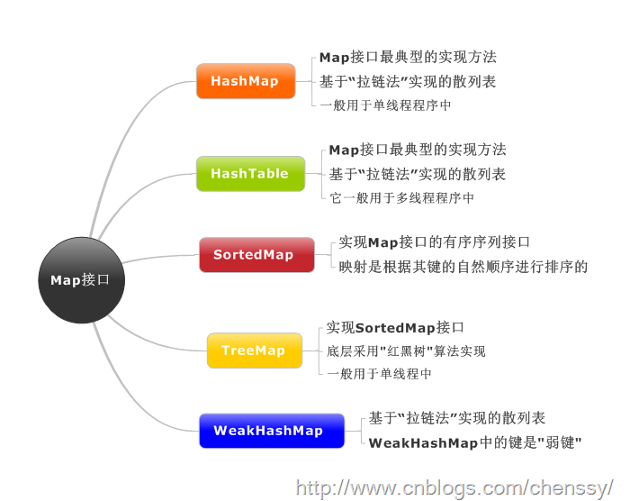

# 集合

## 集合与数组

### 数组

数组（可以存储**基本数据类型**）是用来存现对象的一种容器，但是数组的**长度固定**，不适合在对象数量未知的情况下使用。

### 集合

集合（只能**存储对象**，对象类型可以**不一样**）的**长度可变**，可在多数情况下使用。

## 层次关系

如图所示：图中，实线边框的是**实现类**，折线边框的是**抽象类**，而点线边框的是**接口**


## Collection

接口是集合类的**根接口**，Java中没有提供这个接口的直接的实现类。但是却让其被继承产生了两个接口，就是`Set`和`List`。`Set`中**不能包含重复**的元素。`List`是一个**有序**的集合，**可以包含重复**的元素，提供了**按索引访问**的方式。


``` java
boolean add(E e)
```

> 确保此 collection 包含指定的元素。

***

``` java
void clear()
```

> 移除此 collection 中的所有元素。

***

``` java
boolean contains(Object o)
```

> 如果此 collection 包含指定的元素，则返回 true。

***

``` java
boolean remove(Object o)
```

> 从此 collection 中移除指定元素的单个实例，如果存在的话。

* 如果目标元素不存在，源 collection 不变

***

``` java
int size()
```

> 返回此 collection 中的元素数。

* 如果此 collection 包含的元素大于 Integer.MAX_VALUE，则返回 Integer.MAX_VALUE。

***

``` java
Object[] toArray()
```

> 返回包含此 collection 中所有元素的数组。

***

## Map

`Map`是`Java.util`包中的另一个接口，它和Collection接口**没有关系**，是**相互独立**的，但是**都属于集合类**的一部分。`Map`包含了`key-value`对。`Map`**不能包含重复**的`key`，但是**可以包含相同**的`value`。

> 对`map`集合遍历时先得到**键**的`set`集合，对`set`集合进行遍历，得到相应的值。


* `Map`的`key`**不允许重复**，即同一个`Map`对象的任何两个`key`通过`equals`方法比较总是返回`false`。
* `key`和`value`之间存在**单向一对一**关系，即通过指定的`key`,总能找到**唯一**的、**确定**的`value`。

### HashMap

`HashMap`是最常用的`Map`，它根据键的`HashCode`值存储数据，根据键可以**直接获取**它的值，具有**很快的访问速度**，遍历时，取得数据的顺序是**完全随机**的。因为键对象**不可以重复**，所以`HashMap`**最多只允许一条记录的键为`Null`**，**允许多条记录的值为`Null`**，是非同步的。

### Hashtable

`Hashtable`与`HashMap`类似，是`HashMap`的**线程安全**版，它支持线程的同步，即**任一时刻只有一个线程能写`Hashtable`**，因此也导致了`Hashtale`在**写入时**会比较**慢**，它继承自`Dictionary`类，不同的是它**不允许记录的键或者值为`null`**，同时**效率较低**。

### ConcurrentHashMap

**线程安全**，并且锁分离。`ConcurrentHashMap`内部使用段`(Segment)`来表示这些不同的部分，每个段其实就是一个小的`hash table`，它们有自己的锁。只要多个修改操作发生在不同的段上，它们就可以**并发**进行。

### LinkedHashMap

`LinkedHashMap`保存了记录的**插入顺序**，在用`Iteraor`遍历`LinkedHashMap`时，先得到的记录肯定是**先插入**的，在遍历的时候会比`HashMap`慢，有`HashMap`的**全部特性**。

### TreeMap

`TreeMap`实现`SortMap`接口，能够把它保存的记录根据**键排序**，默认是按键值的**升序排序**（自然顺序），也可以指定排序的比较器，当用`Iterator`遍历`TreeMap`时，得到的记录是排过序的。**不允许`key`值为空，非同步**。

* `TreeMap`判断两个元素相等的标准：两个`key`通过`compareTo()`方法返回`0`，则认为这两个`key`相等。
* 如果使用自定义的类来作为`TreeMap`中的`key`值，且想让`TreeMap`能够良好的工作，则必须**重写**自定义类中的`equals()`方法。



### Map遍历

#### KeySet()

将`Map`中所有的**键**存入到`set`集合中。因为`set`具备**迭代器**。所有可以迭代方式取出所有的键，再根据`get`方法。获取每一个键对应的值。`keySet()`:迭代后只能通过`get()`取`key`。取到的结果会**乱序**，是因为取得数据行主键的时候，使用了`HashMap.keySet()`方法，而这个方法返回的`Set`结果，里面的数据是**乱序排放**的。

``` java
    Map map = new HashMap();
    map.put("key1","lisi1");
    map.put("key2","lisi2");
    map.put("key3","lisi3");
    map.put("key4","lisi4");  
    //先获取map集合的所有键的set集合，keyset()
    Iterator it = map.keySet().iterator();
    //获取迭代器
    while(it.hasNext()) {
        Object key = it.next();
        System.out.println(map.get(key));
    }
```

#### entrySet()

``` java
Set<Map.Entry<K,V>> entrySet() //返回此映射中包含的映射关系的 Set 视图。
```

（一个关系就是一个键-值对），就是把`(key-value)`作为一个整体一对一对地存放到`Set`集合当中的。`Map.Entry`表示映射关系。`entrySet()`：迭代后可以`e.getKey()`，`e.getValue()`两种方法来取`key`和`value`。返回的是`Entry`接口。

``` java
    Map map = new HashMap();
    map.put("key1","lisi1");
    map.put("key2","lisi2");
    map.put("key3","lisi3");
    map.put("key4","lisi4");
    //将map集合中的映射关系取出，存入到set集合
    Iterator it = map.entrySet().iterator();
    while(it.hasNext()) {
        Entry e =(Entry) it.next();
        System.out.println("键"+e.getKey () + "的值为" + e.getValue());
    }
```

* `entrySet()`方法，效率较高：
    * `keySet`其实是遍历了`2`次，一次是转为`iterator`，一次就是从`HashMap`中取出`key`所对于的`value`
    * `entryset`只是遍历了`1`次，它把`key`和`value`都放到了`entry`中，所以效率较高

### HashMap一些功能实现

#### 按值排序

`HashMap`按值排序通过`Collections`的`sort`方法，以下为`HashMap`的几种遍历方式

``` java
    //Collection And Map
    public static void testCM(){
        //Collection
        Map<Integer , String> hs = new HashMap<Integer , String>();
        int i = 0;
        hs.put(199, "序号:"+201);
        while(i<50){
            hs.put(i, "序号:"+i);
            i++;
        }
        hs.put(-1, "序号:"+200);
        hs.put(200, "序号:"+200);

        //遍历方式一:for each遍历HashMap的entryset，注意这种方式在定义的时候就必须写成
        //Map<Integer , String> hs，不能写成Map hs;
        for(Entry<Integer , String> entry : hs.entrySet()){
            System.out.println("key:"+entry.getKey()+"  value:"+entry.getValue());
        }
        //遍历方式二：使用EntrySet的Iterator
        Iterator<Map.Entry<Integer , String>> iterator = hs.entrySet().iterator();
        while(iterator.hasNext()){
            Entry<Integer , String> entry =  iterator.next();
            System.out.println("key:"+entry.getKey()+"  value:"+entry.getValue());
        };
        //遍历方式三：for each直接使用HashMap的keyset
        for(Integer key : hs.keySet()){
            System.out.println("key:"+key+"  value:"+hs.get(key));
        };
        //遍历方式四：使用keyset的Iterator
        Iterator keyIterator = hs.keySet().iterator();
        while(keyIterator.hasNext()){
            Integer key = (Integer)keyIterator.next();
            System.out.println("key:"+key+"  value:"+hs.get(key));
        }
    }
```

* 使用`keyset`的两种方式都会**遍历两次**，所以效率没有使用`EntrySet`高
* `HashMap`输出是**无序**的，这个无序不是说每次遍历的结果顺序不一样，而是说与**插入顺序不一样**

值排序：

``` java
    //对HashMap排序
    public static void sortHashMap(Map<Integer , String> hashmap){

        System.out.println("排序后");

        //第一步，用HashMap构造一个LinkedList
        Set<Entry<Integer , String>> sets = hashmap.entrySet();
        LinkedList<Entry<Integer , String>> linkedList = new LinkedList<Entry<Integer , String>>(sets);

        //用Collections的sort方法排序
        Collections.sort(linkedList , new Comparator<Entry<Integer , String>>(){

            @Override
            public int compare(Entry<Integer , String> o1, Entry<Integer , String> o2) {
                // TODO Auto-generated method stub
                /*String object1 = (String) o1.getValue();
                String object2 = (String) o2.getValue();
                return object1.compareTo(object2);*/
                return o1.getValue().compareTo(o2.getValue());
            }

        });

        //第三步，将排序后的list赋值给LinkedHashMap
        Map<Integer , String> map = new LinkedHashMap();
        for(Entry<Integer , String> entry : linkedList){
            map.put(entry.getKey(), entry.getValue());
        }
        for(Entry<Integer , String> entry : map.entrySet()){
            System.out.println("key:"+entry.getKey()+"  value:"+entry.getValue());
        }
    }
```

#### 键排序

1. 用`Collections`的`sort`方法，更改比较规则
2. `TreeMap`是按**键排序**的，默认**升序**，所以可以通过`TreeMap`来实现
    ``` java
    public static void sortHashMapByKey(Map hashmap){

        System.out.println("按键排序后");

        //第一步：先创建一个TreeMap实例，构造函数传入一个Comparator对象。
        TreeMap<Integer , String> treemap = new TreeMap<Integer , String>(new Comparator<Integer>(){

            @Override
            public int compare(Integer o1,Integer o2) {
                // TODO Auto-generated method stub
                return Integer.compare(o1, o2);
            }

        });
        //第二步：将要排序的HashMap添加到我们构造的TreeMap中。
        treemap.putAll(hashmap);
        for(Entry<Integer , String> entry : treemap.entrySet()){
            System.out.println("key:"+entry.getKey()+"  value:"+entry.getValue());
        }
    }
    ```
3. 可以通过`keyset`取出所有的`key`，然后将`key`排序，再有序的将`key-value`键值对存到`LinkedHashMap`中

#### value去重

对于`HashMap`而言，它的`key`是**不能重复**的，但是它的`value`是**可以重复**的。
将`HashMap`的`key-value`对调，然后赋值给一个新的`HashMap`，由于`key`的不可重复性，此时就将重复值去掉了。最后将新得到的`HashMap`的`key-value`再对调一次即可。

#### HashMap线程同步

1. &nbsp;
    ``` java
    Map<Integer , String> hs = new HashMap<Integer , String>();
        hs = Collections.synchronizedMap(hs);
    ```
2. &nbsp;
    ``` java
    ConcurrentHashMap<Integer , String> hs = new ConcurrentHashMap<Integer , String>();
    ```

## Iterator

`Iterator`，所有的集合类，都**实现**了`Iterator`**接口**，这是一个用于**遍历集合中元素**的接口，主要包含以下三种方法：

1. `boolean hasNext()`是否还有下一个元素。
2. `Object next()`返回下一个元素。
3. `void remove()`删除当前元素。

* 当使用`Iterator`对集合元素进行**迭代**时，`Iterator`并不是把集合元素本身传给了迭代变量，而是把集合元素的**值**传给了迭代变量（就如同参数传递是值传递，基本数据类型传递的是值，引用类型传递的仅仅是对象的引用变量），所以**修改迭代变量的值对集合元素本身没有任何影响**。
* `Iterator`只能**单向移动**
* `Iterator.remove()`是**唯一安全**的方式来在迭代过程中**修改集合**；如果在迭代过程中以任何其它的方式修改了基本集合将会产生未知的行为。而且每调用一次`next()`方法，`remove()`方法只能**被调用一次**，如果违反这个规则将**抛出一个异常**。
* `for-each`底层使用迭代遍历，如果对象可以使用`for-each`，必须实现`Iterable<E>`接口

### ListIterator

`ListIterator`是一个功能更加强大的迭代器, 它继承于`Iterator`接口,**只能**用于各种`List`类型的访问。可以通过调用`listIterator()`方法产生一个指向`List`**开始处**的`ListIterator`, 还可以调用`listIterator(n)`方法创建一个一开始就指向列表索引为`n`的元素处的`ListIterator`。

``` java
public interface ListIterator<E> extends Iterator<E> {
    boolean hasNext();

    E next();

    boolean hasPrevious();

    E previous();

    int nextIndex();

    int previousIndex();

    void remove();

    void set(E e);

    void add(E e);  
}
```

* **双向移动**（向前/向后遍历）
* 产生相对于迭代器在列表中指向的当前位置的前一个和后一个元素的索引
* 可以使用`set()`方法替换它访问过的**最后一个元素**
* 可以使用`add()`方法在`next()`方法返回的元素之前或`previous()`方法返回的元素之后插入一个元素

## List

`List`里存放的对象是**有序**的，同时也是**可以重复**的，`List`关注的是**索引**，拥有一系列和索引相关的方法，**查询速度快**。因为往`list`集合里**插入**或**删除**数据时，会伴随着后面数据的移动，所有插入删除数据速度慢。

### ArrayList

`ArrayList`是一个**动态数组**，也是我们最常用的集合。它允许任何符合规则的元素插入甚至包括`null`。每一个`ArrayList`都有一个**初始容量**（`10`），该容量代表了数组的大小。**随着容器中的元素不断增加，容器的大小也会随着增加**。在每次向容器中增加元素的同时**都会进行容量检查**，**当快溢出时，就会进行扩容操作**。所以如果我们明确所插入元素的多少，最好指定一个初始容量值，避免过多的进行扩容操作而浪费时间、效率。
`size`、`isEmpty`、`ge`t、`set`、`iterator`和`listIterator`操作都以**固定时间**运行。`add`操作以**分摊**的固定时间运行，也就是说，添加`n`个元素需要`O(n)`时间。

* `ArrayList`擅长于随机访问。同时`ArrayList`是**非同步**的。

### LinkedList

同样实现`List`接口的`LinkedList`与`ArrayList`不同，`ArrayList`是一个**动态数组**，而`LinkedList`是一个**双向链表**。所以它除了有`ArrayList`的基本操作方法外还额外提供了`get`，`remove`，`insert`方法在`LinkedList`的**首部**或**尾部**。
由于实现的方式不同，`LinkedList`**不能随机访问**，它所有的操作都是要按照**双重链表**的需要执行。在列表中索引的操作将从**开头**或**结尾**遍历列表（从靠近指定索引的一端）。这样做的好处就是可以通过较低的代价在`List`中进行插入和删除操作。
与`ArrayList`一样，`LinkedList`也是**非同步**的。如果多个线程同时访问一个`List`，则必须**自己实现访问同步**。一种解决方法是在创建`List`时构造一个同步的`List`：

``` java
    List list = Collections.synchronizedList(new LinkedList(...));
```

### Vector

与`ArrayList`相似，但是`Vector`是**同步**的。所以说`Vector`是**线程安全**的**动态数组**。它的操作与`ArrayList`几乎一样。

### Stack

`Stack`继承自`Vector`，实现一个**后进先出**的**堆栈**。`Stack`提供`5`个额外的方法使得`Vector`得以被当作堆栈使用。基本的`push`和`pop`方法，还有`peek`方法得到栈顶的元素，`empty`方法测试堆栈是否为空，`search`方法检测一个元素在堆栈中的位置。`Stack`刚创建后是**空栈**。


## Set

`Set`里存放的对象是**无序**，**不能重复**的，集合中的对象不按特定的方式排序，只是简单地把对象加入集合中。

### HashSet

`HashSet`是一个**没有重复元素**的集合。它是由`HashMap`实现的，不保证元素的顺序(这里所说的没有顺序是指：**元素插入的顺序与输出的顺序不一致**)，而且`HashSet`允许使用`null`元素。`HashSet`是**非同步**的，如果多个线程同时访问一个`HashSet`，而其中至少一个线程修改了该`HashSet`，那么它必须保持**外部同步**。`HashSet`按`Hash`算法来存储集合的元素，因此具有很好的**存取**和**查找**性能。
`HashSet`通过元素的`hashcode()`和`equals()`方法进行判断元素是否重复。如果对象的`hashCode`值是不同的，那么`HashSet`会认为对象是不可能相等的，因此自定义类的时候需要**重写**`hashCode`，来确保对象具有相同的`hashCode`值。如果元素(对象)的`hashCode`值相同，会继续使用`equals`进行比较，如果`equals`为`true`那么新加入的对象重复了，所以加入失败。如果`equals`为`false`，那么`HashSet`认为新加入的对象没有重复，新元素可以存入。
`HashSet`的实现方式大致如下：通过一个`HashMap`存储元素，元素是存放在`HashMap`的`Key`中，而`Value`统一使用**一个**`Object`对象。

* `HashSet`中是允许存入`null`值的，但是在`HashSet`中仅仅能够存入**一个**`null`值。
* `HashSet`中存储的元素的是无序的，但是由于`HashSet`底层是基于`Hash`算法实现的，使用了`hashcode`，所以`HashSet`中**相应**的元素的位置是**固定**的。
* `HashSet`默认初始容量是`16`，加载因子是`0.75f `(`12`开始扩容，每次扩容**一倍**)
* 扩容后进行`rehash`，重新计算元素位置(内存地址%当前容量)

### LinkedHashSet

`LinkedHashSet`继承自`HashSet`，其底层是基于`LinkedHashMap`来实现的，**有序**，**非同步**。`LinkedHashSet`集合同样是根据元素的`hashCode`值来决定元素的存储位置，但是它同时使用**链表**维护元素的次序。这样使得元素看起来像是以插入顺序保存的，也就是说，当遍历该集合时候，`LinkedHashSet`将会**以元素的添加顺序访问集合的元素**。

### TreeSet

`TreeSet`是一个`有序`集合，其底层是基于`TreeMap`实现的，**非线程安全**。`TreeSet`可以确保集合元素**处于排序状态**。`TreeSet`支持两种排序方式，**自然排序**和**定制排序**，其中自然排序为默认的排序方式。当我们构造`TreeSet`时，若使用**不带参数**的**构造函数**，则`TreeSet`使用自然比较器；若用户需要使用**自定义的比较器**，则需要使用带比较器的参数。
`TreeSet`集合不是通过`hashcode`和`equals`函数来比较元素的.它是通过`compare`或者`comparaeTo`函数来判断元素是否相等.`compare`函数通过判断两个对象的`id`，相同的`id`判断为**重复元素**，**不会被加入到集合中**。

## List、Set、Map的区别

* List（有序、可重复）
* Set（无序、不能重复）
* Map（键值对、键唯一、值不唯一）

| &nbsp;     | &nbsp;      | 是否有序      | 是否允许元素重复                              |
| ---------- | ----------- | --------- | ------------------------------------- |
| Collection | &nbsp;      | &nbsp;    | &nbsp;                                |
| List       | &nbsp;      | 是         | 是                                     |
| Set        | AbstractSet | 否         | 否                                     |
| &nbsp;     | HashSet     | 否         | 否                                     |
| &nbsp;     | TreeSet     | 是（用二叉树排序） | 否                                     |
| Map        | AbstractMap | 否         | 使用key-value来映射和存储数据，key必须唯一，value可以重复 |
| &nbsp;     | HashMap     | 否         | 使用key-value来映射和存储数据，key必须唯一，value可以重复 |
| &nbsp;     | TreeMap     | 是（用二叉排序树） | 使用key-value来映射和存储数据，key必须唯一，value可以重复 |

## 遍历

在类集中提供了以下四种的常见输出方式：

1. `Iterator`：**迭代**输出，是使用最多的输出方式。

    ``` java
    Iterator it = arr.iterator();
    while(it.hasNext()) {
        object o =it.next();
        ...
    }
    ```

2. `ListIterator`：是`Iterator`的**子接口**，专门用于输出`List`中的内容。
3. `foreach`输出：JDK1.5之后提供的新功能，可以输出**数组**或**集合**。

    ``` java
    for(int　i：arr) {
        ...
    }
    ```
4. `for`循环

    ``` java
    for(int i=0;i<arr.size();i++) {
        ...
    }
    ```

## 主要实现类区别小结

### Vector和ArrayList

1. `vector`是**线程同步**的，所以它也是**线程安全**的，而`arraylist`是**线程异步**的，是**不安全**的。如果不考虑到线程的安全因素，一般用`arraylist`效率比较**高**。
2. 如果集合中的元素的数目大于目前集合数组的长度时，`vector`增长率为目前数组长度的`100%`，而`arraylist`增长率为目前数组长度的`50%`。如果在集合中使用数据量比较大的数据，用`vector`有一定的优势。
3. 如果查找一个**指定位置**的数据，`vector`和`arraylist`使用的时间是相同的，如果**频繁**的访问数据，这个时候使用`vector`和`arraylist`都可以。而如果移动一个指定位置会导致后面的元素都发生移动，这个时候就应该考虑到使用`linklist`,因为它移动一个指定位置的数据时**其它元素不移动**。

`ArrayList`和`Vector`是采用**数组**方式存储数据，此数组元素数**大于**实际存储的数据以便增加和插入元素，都允许直接序号索引元素，但是插入数据要涉及到数组元素移动等内存操作，所以**索引数据快**，**插入数据慢**，`Vector`由于使用了`synchronized`方法（线程安全）所以性能上比`ArrayList`要差，`LinkedList`使用**双向链表**实现存储，按序号索引数据需要进行向前或向后遍历，但是插入数据时只需要记录本项的前后项即可，所以插入数度较快。

### arraylist和linkedlist

1. `ArrayList`是实现了基于**动态数组**的数据结构，`LinkedList`基于**链表**的数据结构。
2. 对于随机访问`get`和`set`，`ArrayList`优于`LinkedList`，因为`LinkedList`要移动指针。
3. 对于新增和删除操作`add`和`remove`，`LinkedList`比较占优势，因为`ArrayList`要移动数据。这一点要看实际情况的。若只对**单条数据**插入或删除，`ArrayList`的速度反而优于`LinkedList`。但若是**批量随机**的插入删除数据，`LinkedList`的速度大大优于`ArrayList`，因为`ArrayList`每插入一条数据，要移动插入点及之后的所有数据。

### HashMap与TreeMap

1. `HashMap`通过`hashcode`对其内容进行快速查找，而`TreeMap`中所有的元素都保持着某种固定的顺序，如果你需要得到一个有序的结果你就应该使用`TreeMap`（`HashMap`中元素的排列顺序是不固定的）。
2. 在`Map`中插入、删除和定位元素，`HashMap`是最好的选择。但如果要按自然顺序或自定义顺序遍历键，那么`TreeMap`会更好。使用`HashMap`要求添加的键类明确定义了`hashCode()`和`equals()`的实现。

两个`map`中的元素一样，但顺序不一样，导致`hashCode()`不一样。
同样做测试：
在`HashMap`中，同样的值的`map`,顺序不同，`equals`时，`false`;
而在`treeMap`中，同样的值的`map`,顺序不同,`equals`时，`true`，说明，`treeMap`在`equals()`时是整理了顺序的。

### HashTable与HashMap

1. 同步性:`Hashtable`是**线程安全**的，也就是说是同步的，而`HashMap`是**线程序不安全**的，不是同步的。
2. `HashMap`允许存在**一个**为`null`的`key`，**多个**为`null`的`value` 。
3. `hashtable`的`key`和`value`都不允许为`null`。

### Collection和Collections

1. `java.util.Collection`是一个**集合接口**（集合类的一个**顶级接口**）。它提供了对集合对象进行基本操作的通用接口方法。`Collection`接口的意义是为各种具体的集合提供了最大化的统一操作方式，其直接继承接口有`List`与`Set`。
    ``` mermaid
    graph TD
     Collection-->List
     Collection-->Set
     List-->LinkedList
     List-->ArrayList
     List-->Vector
     Vector-->Stack
    ```
2. `java.util.Collections`是一个**包装类**（工具类/帮助类）。它包含有各种有关**集合操作**的**静态多态**方法。**此类不能实例化**，就像一个工具类，用于对集合中元素进行**排序**、**搜索**以及**线程安全**等各种操作，服务于Java的`Collection`框架。
    ``` java
    import java.util.ArrayList;
    import java.util.Collections;
    import java.util.List;
  
    public class TestCollections {
        public static void main(String args[]) {
            //注意List是实现Collection接口的
            List list = new ArrayList();
            double array[] = { 112, 111, 23, 456, 231 };
            for (int i = 0; i < array.length; i++) {
                list.add(new Double(array[i]));
            }
            Collections.sort(list);
            for (int i = 0; i < array.length; i++) {
                System.out.println(list.get(i));
            }
            // 结果：23.0 111.0 112.0 231.0 456.0
        }
    }
    ```